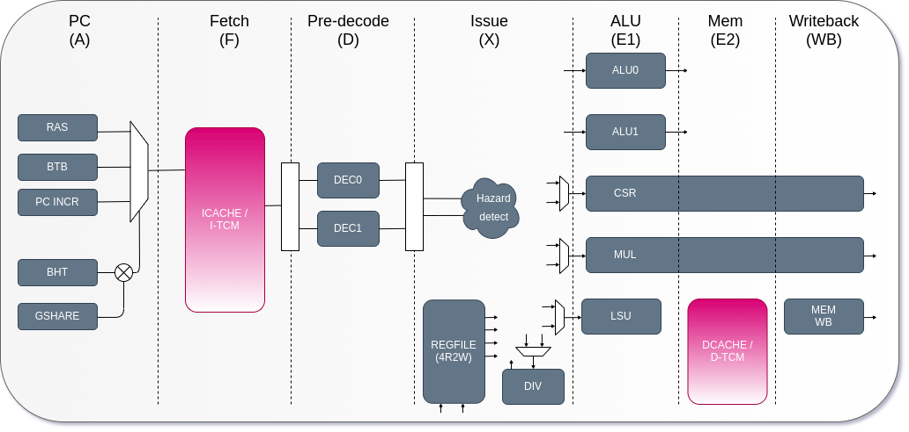

# RISCV Load Store with OTP Encription
 An implementation of RISC-V Based Processor with load and store unit extended for OTP Encryption

## Based on biRISC-V - 32-bit dual issue RISC-V CPU

Github: [http://github.com/ultraembedded/biriscv](http://github.com/ultraembedded/biriscv)

